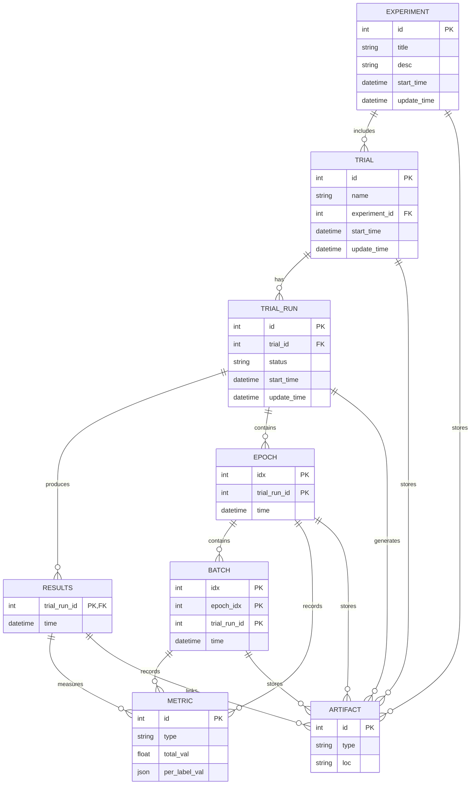

```mermaid

erDiagram
    EXPERIMENT {
        int id PK
        string title
        string desc
        datetime start_time
        datetime update_time
    }
    
    TRIAL {
        int id PK
        string name
        int experiment_id FK
        datetime start_time
        datetime update_time
    }
    
    TRIAL_RUN {
        int id PK
        int trial_id FK
        string status
        datetime start_time
        datetime update_time
    }
    
    RESULTS {
        int trial_run_id PK, FK
        datetime time
    }
    
    EPOCH {
        int idx PK
        int trial_run_id PK
        datetime time
    }
    
    BATCH {
        int idx PK
        int epoch_idx PK
        int trial_run_id PK
        datetime time
    }
    
    METRIC {
        int id PK
        string type
        float total_val
        json per_label_val
    }
    
    ARTIFACT {
        int id PK
        string type
        string loc
    }
    
    EXPERIMENT ||--o{ TRIAL : includes
    EXPERIMENT ||--o{ ARTIFACT : stores
    TRIAL ||--o{ TRIAL_RUN : has
    TRIAL ||--o{ ARTIFACT : stores
    TRIAL_RUN ||--o{ RESULTS : produces
    TRIAL_RUN ||--o{ EPOCH : contains
    TRIAL_RUN ||--o{ ARTIFACT : generates
    EPOCH ||--o{ BATCH : contains
    RESULTS ||--o{ METRIC : measures
    RESULTS ||--o{ ARTIFACT : links
    EPOCH ||--o{ METRIC : records
    EPOCH ||--o{ ARTIFACT : stores
    BATCH ||--o{ METRIC : records
    BATCH ||--o{ ARTIFACT : stores


```
