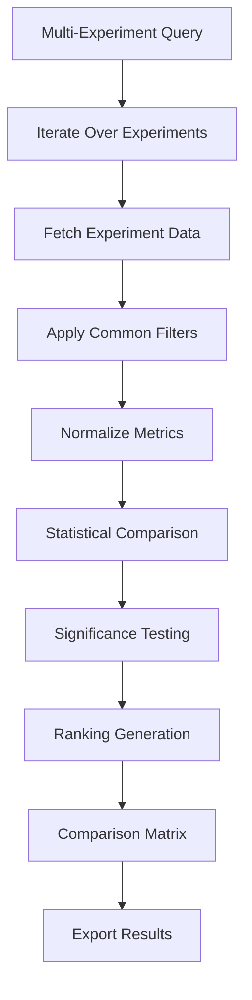
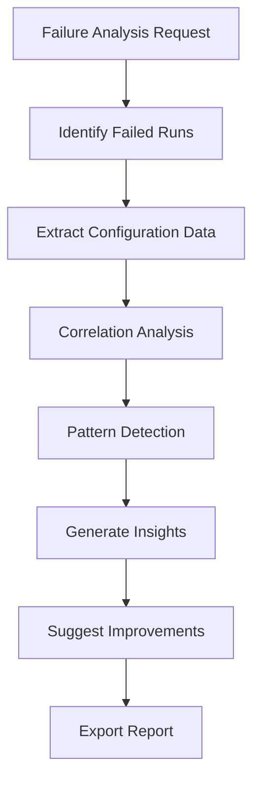

# Experiment Analytics Module - Integration Design Document

> **Note**: This feature design document has been integrated into the main project documentation. The analytics module architecture and implementation details are now documented in:
> - **README.md** - User-facing features and usage examples
> - **COMPREHENSIVE_DOCUMENTATION.md** - Technical architecture and integration details  
> - **scripts/DESIGN.md** - Core design patterns and component integration
> 
> This file is maintained for historical reference and initial specification details.

---

## Executive Summary

The **Experiment Analytics Module** will be integrated as a core feature within the existing Experiment Manager, providing sophisticated data analysis capabilities for experiment results, statistical aggregations, failure analysis, and comparative analytics. This module will directly leverage the existing database schema and follow established architectural patterns.

---

## 1. High-Level Entity Relationship Diagram

```
┌─────────────────────────────────────────────────────────────────┐
│                    EXPERIMENT MANAGER CORE                      │
│                                                                 │
│  ┌─────────────┐  ┌─────────────┐  ┌─────────────┐              │
│  │ Environment │  │ Experiment  │  │ Pipeline    │              │
│  │ Management  │  │ Management  │  │ System      │              │
│  └─────────────┘  └─────────────┘  └─────────────┘              │
│                                                                 │
│  ┌─────────────┐  ┌─────────────┐  ┌─────────────┐              │
│  │ Tracking    │  │ Storage     │  │ Analytics   │◄── NEW       │
│  │ System      │  │ System      │  │ Module      │              │
│  └─────────────┘  └─────────────┘  └─────────────┘              │
└─────────────────────────────────────────────────────────────────┘

┌─────────────────────────────────────────────────────────────────┐
│                   ANALYTICS MODULE ENTITIES                     │
│                                                                 │
│  ┌─────────────────┐           ┌─────────────────┐              │
│  │ AnalyticsEngine │◄──────────│ QueryBuilder    │              │
│  │                 │           │                 │              │
│  │ - fetch_data()  │           │ - experiments() │              │
│  │ - process()     │           │ - trials()      │              │
│  │ - aggregate()   │           │ - runs()        │              │
│  │ - apply_filters()│          │ - metrics()     │              │
│  └─────────────────┘           │ - execute()     │              │
│           │                    └─────────────────┘              │
│           │                                                     │
│           ▼                                                     │
│  ┌─────────────────┐                                            │
│  │ ProcessorManager│                                            │
│  │                 │                                            │
│  │ - register()    │                                            │
│  │ - execute()     │                                            │
│  └─────────────────┘                                            │
│           │                                                     │
│    ┌─────────┬─────────┬─────────────┐                          │ 
│    ▼         ▼         ▼             ▼                          │
│ ┌──────┐ ┌────────┐ ┌─────────┐ ┌──────────┐                    │
│ │Stats │ │Outlier │ │Failure  │ │Comparison│                    │
│ │Proc  │ │Proc    │ │Analyzer │ │Proc      │                    │
│ └──────┘ └────────┘ └─────────┘ └──────────┘                    │
│                                                                 │
│  ┌─────────────────┐                                            │
│  │ AnalyticsResult │                                            │
│  │                 │                                            │
│  │ - raw_data      │                                            │
│  │ - aggregations  │                                            │
│  │ - exclusions    │                                            │
│  │ - metadata      │                                            │
│  │ - export()      │                                            │
│  └─────────────────┘                                            │
└─────────────────────────────────────────────────────────────────┘

┌─────────────────────────────────────────────────────────────────┐
│                   DATABASE INTEGRATION                          │
│                                                                 │
│  ┌─────────────────┐                                            │
│  │ DatabaseManager │ (Existing - Enhanced)                      │
│  │                 │                                            │
│  │ - get_experiments()                                          │
│  │ - get_trials()                                               │
│  │ - get_trial_runs()                                           │
│  │ - get_metrics()                                              │
│  │ + get_analytics_data()     ◄── NEW METHODS                   │
│  │ + get_aggregated_metrics() ◄── NEW METHODS                   │
│  │ + get_failure_data()       ◄── NEW METHODS                   │
│  └─────────────────┘                                            │
└─────────────────────────────────────────────────────────────────┘
```

---

## 2. System Architecture Overview

### 2.1 Integration Points

The Analytics Module integrates with existing Experiment Manager components:

1. **DatabaseManager**: Enhanced with analytics-specific query methods
2. **Environment**: Analytics results stored in workspace hierarchy
3. **Factory Pattern**: Analytics components registered using existing `@YAMLSerializable.register`
4. **Configuration System**: Analytics configuration follows existing YAML patterns

### 2.2 Module Structure

```
experiment_manager/
├── analytics/                    # NEW: Analytics module
│   ├── __init__.py              # Module initialization and exports
│   ├── engine.py                # AnalyticsEngine core class
│   ├── query_builder.py         # Fluent query API
│   ├── processors/              # Data processing components
│   │   ├── __init__.py
│   │   ├── base.py             # Abstract DataProcessor
│   │   ├── statistics.py       # Statistical calculations
│   │   ├── outliers.py         # Outlier detection/removal
│   │   ├── failures.py         # Failure pattern analysis
│   │   └── comparisons.py      # Cross-experiment comparisons
│   ├── results.py              # AnalyticsResult container
│   └── api.py                  # High-level user-facing API
├── database/                    # ENHANCED: Existing database
│   ├── database_manager.py     # Enhanced with analytics methods
│   └── ...
├── environment.py              # ENHANCED: Workspace management
└── ...
```

---

## 3. Detailed Component Design

### 3.1 Core Analytics Components

#### AnalyticsEngine
**Purpose**: Central orchestrator for analytics operations
**Responsibilities**:
- Coordinate data fetching from DatabaseManager
- Apply filtering and exclusion rules
- Orchestrate processor execution
- Compile results into AnalyticsResult objects

**Key Methods**:
- `fetch_experiment_data(filters)`: Extract hierarchical experiment data
- `process_query(query_builder)`: Execute complete analytics pipeline
- `apply_exclusions(data, rules)`: Apply outlier/failure exclusions
- `aggregate_metrics(data, functions)`: Perform statistical aggregations

#### QueryBuilder
**Purpose**: Fluent API for constructing analytics queries
**Responsibilities**:
- Provide intuitive query construction interface
- Validate filter combinations
- Build structured filter specifications for AnalyticsEngine

**Key Methods**:
- `experiments(ids, names, time_range)`: Filter experiments
- `trials(names, status_filter)`: Filter trials
- `runs(status, exclude_failed)`: Filter trial runs
- `metrics(types, context)`: Filter metrics (results vs epoch)
- `exclude_outliers(metric, method, threshold)`: Add outlier exclusion
- `aggregate(functions)`: Specify aggregation operations

#### ProcessorManager
**Purpose**: Manage and execute data processing operations
**Responsibilities**:
- Register available processors
- Execute processors in correct order
- Handle processor dependencies and conflicts

**Design Pattern**: Strategy Pattern - different algorithms for different analysis types

### 3.2 Data Processors

#### StatisticsProcessor
**Purpose**: Calculate statistical measures across experiment data
**Capabilities**:
- Basic statistics: mean, median, std, min, max, count
- Grouped statistics: by trial, experiment, or custom grouping
- Confidence intervals and percentiles
- Missing data handling strategies

#### OutlierProcessor
**Purpose**: Detect and exclude statistical outliers
**Methods**:
- **IQR Method**: Interquartile range-based detection
- **Z-Score Method**: Standard deviation-based detection
- **Modified Z-Score**: Median absolute deviation-based
- **Custom Thresholds**: User-defined boundaries

#### FailureAnalyzer
**Purpose**: Analyze patterns in failed experiment runs
**Capabilities**:
- Failure rate calculations by experiment/trial/configuration
- Configuration correlation analysis
- Temporal failure pattern detection
- Root cause suggestion algorithms

#### ComparisonProcessor
**Purpose**: Compare performance across experiments/trials
**Capabilities**:
- Statistical significance testing (t-tests, Mann-Whitney U)
- Effect size calculations
- Performance ranking with confidence intervals
- Multi-dimensional comparison matrices

### 3.3 Result Management

#### AnalyticsResult
**Purpose**: Container for analytics results with export capabilities
**Properties**:
- `raw_data`: Original filtered data
- `aggregated_data`: Statistical summaries
- `excluded_runs`: Lists of excluded run IDs
- `exclusion_reasons`: Justification for exclusions
- `metadata`: Query parameters and execution context

**Export Formats**:
- CSV: Tabular data export
- JSON: Structured data with metadata
- DataFrame: Pandas integration for further analysis
- Summary Reports: Human-readable analysis summaries

---

## 4. Workflow Design

### 4.1 Basic Analytics Workflow

```mermaid
graph TD
    A[User Query Request] --> B[QueryBuilder Construction]
    B --> C[Filter Validation]
    C --> D[AnalyticsEngine.process()]
    D --> E[DatabaseManager Query]
    E --> F[Data Fetch & Join]
    F --> G[Apply Exclusions]
    G --> H[Execute Processors]
    H --> I[Aggregate Results]
    I --> J[Build AnalyticsResult]
    J --> K[Export/Return]
```

### 4.2 Complex Multi-Experiment Comparison Workflow



### 4.3 Failure Analysis Workflow



---

## 5. Database Integration Enhancements

### 5.1 Enhanced DatabaseManager Methods

**New Analytics-Specific Methods**:

1. **`get_analytics_data(experiment_ids, filters)`**
   - Single query to fetch hierarchical experiment data
   - Optimized joins across experiment → trial → trial_run → metrics
   - Include configuration data when requested
   - Return structured data ready for processing

2. **`get_aggregated_metrics(experiment_ids, group_by, functions)`**
   - Pre-aggregate common statistics in database
   - Reduce data transfer for large experiments
   - Support grouping by trial, experiment, or time periods

3. **`get_failure_data(experiment_ids, include_configs)`**
   - Specialized query for failure analysis
   - Join run status with configuration parameters
   - Include timing and error information

4. **`get_epoch_series(trial_run_ids, metric_types)`**
   - Time series data for training curve analysis
   - Optimized for epoch-level metric extraction
   - Support metric evolution visualization

### 5.2 Query Optimization Strategies

**Indexed Queries**:
- Add composite indexes on (experiment_id, status) for run filtering
- Index metric_type for fast metric filtering
- Temporal indexes on start_time/update_time for time-range queries

**Join Optimization**:
- Use LEFT JOINs for optional data (configurations, artifacts)
- Implement query result caching for repeated analytics operations
- Batch processing for large experiment sets

---

## 6. API Design

### 6.1 High-Level User API

```python
# Primary interface for users
class ExperimentAnalytics:
    def __init__(self, database_manager: DatabaseManager)
    
    # Core analytics operations
    def extract_results(experiment_name, include_failed=False) -> AnalyticsResult
    def calculate_statistics(experiment_id, metric_types, group_by='trial') -> Dict
    def analyze_failures(experiment_id, correlation_analysis=True) -> Dict
    def compare_experiments(experiment_ids, metric_type) -> AnalyticsResult
    
    # Advanced operations
    def detect_outliers(experiment_id, metric_type, method='iqr') -> List[int]
    def analyze_training_curves(trial_run_ids, metric_types) -> AnalyticsResult
    def generate_summary_report(experiment_id) -> str
```

### 6.2 Fluent Query API

```python
# Advanced query building interface
class AnalyticsQuery:
    def __init__(self, analytics_engine: AnalyticsEngine)
    
    # Filter methods (chainable)
    def experiments(ids=None, names=None, time_range=None) -> 'AnalyticsQuery'
    def trials(names=None, status=None) -> 'AnalyticsQuery'
    def runs(status=['completed'], exclude_timeouts=True) -> 'AnalyticsQuery'
    def metrics(types=None, context='results') -> 'AnalyticsQuery'
    
    # Processing methods (chainable)
    def exclude_outliers(metric_type, method='iqr', threshold=1.5) -> 'AnalyticsQuery'
    def aggregate(functions=['mean', 'std']) -> 'AnalyticsQuery'
    def group_by(field='trial') -> 'AnalyticsQuery'
    
    # Execution
    def execute() -> AnalyticsResult
```

### 6.3 Configuration Integration

**Analytics Configuration Structure**:
```yaml
# analytics_config.yaml
analytics:
  default_processors:
    - statistics
    - outliers
    
  outlier_detection:
    default_method: "iqr"
    default_threshold: 1.5
    
  aggregation_functions:
    - mean
    - std
    - min
    - max
    - count
    
  export_formats:
    - csv
    - json
    
  failure_analysis:
    correlation_threshold: 0.5
    min_failure_count: 3
```

---

## 7. Integration with Existing Patterns

### 7.1 Factory-Serializable Pattern Integration

**Analytics Components Registration**:
```python
@YAMLSerializable.register('statistics_processor')
class StatisticsProcessor(DataProcessor):
    # Implementation

@YAMLSerializable.register('outlier_processor')  
class OutlierProcessor(DataProcessor):
    # Implementation
```

### 7.2 Environment Integration

**Workspace Organization**:
```
workspace/
├── experiment_name/
│   ├── analytics/              # NEW: Analytics outputs
│   │   ├── reports/           # Generated reports
│   │   ├── exports/           # CSV/JSON exports
│   │   └── comparisons/       # Cross-experiment comparisons
│   ├── configs/
│   ├── logs/
│   └── artifacts/
```

### 7.3 Hierarchical Level Integration

**Analytics operates across all levels**:
- **EXPERIMENT**: Cross-trial aggregations and comparisons
- **TRIAL**: Trial-specific performance analysis
- **TRIAL_RUN**: Individual run analysis and outlier detection
- **EPOCH**: Training curve analysis and convergence detection
- **RESULTS**: Final metric aggregations and statistical summaries

---

## 8. User Experience & Use Cases

### 8.1 Data Scientist Workflow

**Scenario**: Analyzing transformer model experiment results

1. **Quick Overview**: `analytics.extract_results("transformer_comparison")`
2. **Statistical Analysis**: `analytics.calculate_statistics(exp_id, ["accuracy", "loss"])`
3. **Outlier Investigation**: `analytics.detect_outliers(exp_id, "accuracy")`
4. **Export for Further Analysis**: `results.export_csv("analysis.csv")`

### 8.2 ML Engineer Workflow

**Scenario**: Investigating failed training runs

1. **Failure Analysis**: `analytics.analyze_failures(exp_id, correlation_analysis=True)`
2. **Pattern Detection**: Review configuration correlations with failures
3. **Improvement Recommendations**: Get suggested parameter ranges
4. **Report Generation**: Export failure analysis for team review

### 8.3 Research Workflow

**Scenario**: Comparing multiple architectural approaches

1. **Multi-Experiment Comparison**: `analytics.compare_experiments([exp1, exp2, exp3], "f1_score")`
2. **Statistical Significance**: Automatic significance testing in comparison
3. **Ranking Generation**: Performance ranking with confidence intervals
4. **Publication Export**: Generate summary tables for research papers

---

## 9. Error Handling & Validation

### 9.1 Input Validation

**Query Validation**:
- Verify experiment IDs exist in database
- Validate metric type names against available metrics
- Check filter combinations for logical consistency
- Validate aggregation function names

**Data Validation**:
- Handle missing metric values gracefully
- Validate numeric data types for statistical operations
- Check for sufficient data points before analysis
- Warn about potential statistical issues (small sample sizes)

### 9.2 Error Recovery

**Graceful Degradation**:
- Continue analysis with partial data when some trials fail
- Provide warnings about excluded data
- Offer alternative analysis methods when primary methods fail
- Cache intermediate results for large queries

---

## 10. Performance Considerations

### 10.1 Database Performance

**Query Optimization**:
- Use database-level aggregations when possible
- Implement result caching for expensive operations
- Batch process large experiment sets
- Use streaming for very large datasets

**Memory Management**:
- Lazy loading of metric data
- Chunked processing for large experiments
- Optional data compression for exports
- Cleanup temporary data structures

### 10.2 Scalability Strategies

**Large-Scale Experiments**:
- Parallel processing for independent analysis operations
- Configurable batch sizes for database queries
- Optional sampling for exploratory analysis
- Progress tracking for long-running operations

---

## 11. Testing Strategy

### 11.1 Unit Testing

**Component Testing**:
- Test each processor with known datasets
- Validate statistical calculations against reference implementations
- Test query builder filter combinations
- Verify export format correctness

### 11.2 Integration Testing

**Database Integration**:
- Test with existing experiment database schemas
- Verify correct handling of hierarchical data
- Test performance with large datasets
- Validate transaction handling

### 11.3 End-to-End Testing

**User Workflow Testing**:
- Complete analytics workflows from query to export
- Multi-user concurrent access testing
- Long-running experiment analysis testing
- Error condition handling validation

---

## 12. Deployment & Migration

### 12.1 Backwards Compatibility

**Existing System Integration**:
- Zero changes required to existing Experiment Manager usage
- Analytics module loaded optionally
- Existing database schema unchanged
- Current experiment workflows unaffected

### 12.2 Rollout Strategy

**Phased Deployment**:
1. **Phase 1**: Core analytics API with basic statistics
2. **Phase 2**: Advanced processors (outliers, failures)
3. **Phase 3**: Multi-experiment comparisons and reporting
4. **Phase 4**: Advanced visualizations and integrations

This design provides a comprehensive, integrated analytics solution that leverages the existing Experiment Manager architecture while adding powerful new capabilities for experiment analysis and insight generation.